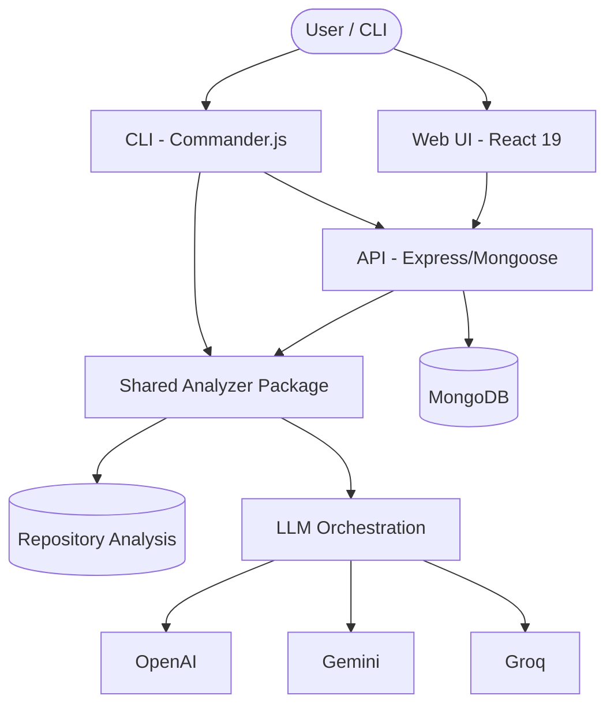

<div align="center">
  
  
  # 🚀 readme-gen
  
  **AI-native README generation platform for modern software repositories.**
  
  [](https://opensource.org/licenses/MIT)
  [](https://pnpm.io/)
  [](https://github.com/prettier/prettier)

  [Overview](#overview) • [Core Features](#core-features) • [Architecture](#architecture) • [Getting Started](#getting-started) • [Deployment](#deployment)
</div>

---

## 📺 Demo

<!-- DEMO_PLACEHOLDER -->
[Replace this text with your demo video or interactive preview]
<!-- END_DEMO_PLACEHOLDER -->

---

## 📖 Overview

`readme-gen` is an enterprise-grade platform designed to eliminate the friction of writing and maintaining project documentation. It analyzes your repository, extracts grounded codebase evidence, and orchestrates state-of-the-art LLMs (OpenAI, Gemini, Groq) to generate accurate, professional, and context-aware README files.

### Why Grounding Matters?
Unlike traditional AI documentation tools that "guess" based on file names, `readme-gen` uses its **Shared Analyzer** to inspect:
- **Routes & API Signatures**: Express, Fastify, and more.
- **Dependencies**: Package manifests and versioning.
- **Environment Context**: Required env vars and their purposes.
- **Project Intent**: AST-level analysis of your source code.

---

## ✨ Core Features

| Feature | Description |
| :--- | :--- |
| **Grounded Generation** | Uses real code evidence to eliminate AI hallucinations. |
| **Rewrite & Append** | Intelligently updates existing READMEs without losing custom sections. |
| **Multi-Model Support** | Choose between OpenAI, Gemini, or Groq for your generations. |
| **Web & CLI Flows** | Work where you are—either in a sleek dashboard or the terminal. |
| **Monorepo Ready** | Supports nested README generation for complex workspace structures. |
| **BYOK Support** | High-volume users can "Bring Your Own Key" to bypass platform limits. |

---

## 🏗️ Architecture

`readme-gen` is architected as a modern monorepo using **Turborepo** and **pnpm**.



### Monorepo Structure

- **`apps/web`**: React 19 + Vite dashboard for management and visual editing.
- **`apps/api`**: Node.js backend handling analysis, generation, and persistence.
- **`apps/cli`**: The `readmegen` command-line tool for local-only generation.
- **`packages/analyzer`**: The core extraction logic and semantic generation pipeline.

---

## 🚀 Getting Started

### Prerequisites
- **Node.js**: v20+
- **pnpm**: v9+
- **MongoDB**: For project persistence (Web & API flows)
- **API Keys**: At least one from OpenAI, Google (Gemini), or Groq.

### Installation

```bash
# Clone the repository
git clone https://github.com/your-username/readme-gen.git
cd readme-gen

# Install dependencies
pnpm install

# Build the workspace
pnpm build
```

### Running Locally

```bash
# Start all services (API, Web) in dev mode
pnpm dev
```

---

## 🛠️ CLI Usage

The CLI (`readmegen`) is perfect for developers who want to generate documentation without leaving the terminal.

```bash
# Initialize with your API keys
readmegen init

# Generate a README for the current directory
readmegen generate --tone professional --mode rewrite
```

For more details, see the [CLI README](apps/cli/README.md).

---

## 🛡️ Environment Variables

Copy `.env.example` to `.env` in the root and fill in your keys:

```env
MONGODB_URI=mongodb://localhost:27017/readme-gen
OPENAI_API_KEY=sk-...
GOOGLE_GENERATIVE_AI_API_KEY=AIza...
GROQ_API_KEY=gsk_...
```

---

## 🤝 Contributing

We welcome contributions! Please see our [Contributing Guide](CONTRIBUTING.md) for more details.

1. Fork the Project
2. Create your Feature Branch (`git checkout -b feature/AmazingFeature`)
3. Commit your Changes (`git commit -m 'Add some AmazingFeature'`)
4. Push to the Branch (`git push origin feature/AmazingFeature`)
5. Open a Pull Request

---

## 📄 License

This project is licensed under the MIT License - see the [LICENSE](LICENSE) file for details.

<div align="center">
  <sub>Built with ❤️ by the readme-gen team.</sub>
</div>
