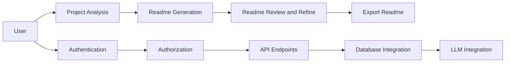

# api

> Backend API for readme-gen

  

[README](README.md)


# ReadMeGen API

## Overview

ReadMeGen API is a comprehensive platform for generating high-quality Readme files for software projects. It leverages a modular architecture, integrating various services and libraries, such as Mongoose for database interactions, Express.js for API routing, and LangChain for large language model (LLM) integration.

## Architecture



## Installation

To set up the ReadMeGen API, follow these steps:

1. Clone the repository: `git clone https://github.com/your-username/readmegeng-api.git`
2. Install dependencies: `npm install`
3. Create a `.env` file with the following environment variables:
```makefile
PORT=your_value_here
FRONTEND_URL=your_value_here
JWT_SECRET=your_value_here
MONGODB_URI=your_value_here
GITHUB_TOKEN=your_value_here
GOOGLE_GENERATIVE_AI_API_KEY=your_value_here
GROQ_API_KEY=your_value_here
GOOGLE_CLIENT_ID=your_value_here
GOOGLE_CLIENT_SECRET=your_value_here
GITHUB_CLIENT_ID=your_value_here
GITHUB_CLIENT_SECRET=your_value_here
```
4. Run the application: `npm run dev`

## Usage

To generate a Readme file, follow these steps:

1. Send a `POST` request to the `/analyze` endpoint with the project's repository URL:
```bash
curl -X POST \
  http://localhost:3000/api/analyze \
  -H 'Content-Type: application/json' \
  -d '{"repositoryUrl": "https://github.com/your-username/your-project"}'
```
2. The API will analyze the project and return a `ProjectAnalysis` object.
3. Send a `POST` request to the `/generate` endpoint with the `ProjectAnalysis` object:
```bash
curl -X POST \
  http://localhost:3000/api/generate \
  -H 'Content-Type: application/json' \
  -d '{"analysis": {"projectName": "Your Project", "description": "This is a sample project"}}'
```
4. The API will generate a Readme file based on the `ProjectAnalysis` object and return the file content.

## Deployment

To deploy the ReadMeGen API, follow these steps:

1. Build the application: `npm run build`
2. Create a Docker image: `docker build -t readmegeng-api .`
3. Run the Docker container: `docker run -p 3000:3000 readmegeng-api`

## Contributing

To contribute to the ReadMeGen API, follow these guidelines:

1. Fork the repository: `git fork https://github.com/your-username/readmegeng-api.git`
2. Create a new branch: `git branch feature/new-feature`
3. Implement the new feature: `git add . && git commit -m "Implemented new feature"`
4. Push the changes: `git push origin feature/new-feature`
5. Create a pull request: `git pull-request feature/new-feature`

## License

The ReadMeGen API is licensed under the MIT License.

## Tech Stack

* Built with: TypeScript, Express, Environment Configuration, API Endpoints, Authentication, Database Integration
* Key dependencies:
	+ `@langchain/core`
	+ `@langchain/google-genai`
	+ `@langchain/groq`
	+ `axios`
	+ `bcryptjs`
	+ `cookie-parser`
	+ `cors`
	+ `dotenv`
	+ `express`
	+ `ignore`
	+ `jsonwebtoken`
	+ `mongoose`
	+ `passport`
	+ `passport-github2`
	+ `passport-google-oauth20`
	+ `passport-jwt`
	+ `passport-local`
	+ `@readme-gen/analyzer`

## API Endpoints

| Method | Endpoint | Description |
| --- | --- | --- |
| `POST` | `/analyze` | Analyze a project's repository URL and return a `ProjectAnalysis` object |
| `POST` | `/generate` | Generate a Readme file based on a `ProjectAnalysis` object |
| `GET` | `/health` | Return a health check response |

## Environment Variables

| Variable | Description |
| --- | --- |
| `PORT` | The port number to listen on |
| `FRONTEND_URL` | The URL of the frontend application |
| `JWT_SECRET` | The secret key for JSON Web Tokens |
| `MONGODB_URI` | The connection string for the MongoDB database |
| `GITHUB_TOKEN` | The GitHub token for authentication |
| `GOOGLE_GENERATIVE_AI_API_KEY` | The Google Generative AI API key |
| `GROQ_API_KEY` | The Groq API key |
| `GOOGLE_CLIENT_ID` | The Google Client ID |
| `GOOGLE_CLIENT_SECRET` | The Google Client Secret |
| `GITHUB_CLIENT_ID` | The GitHub Client ID |
| `GITHUB_CLIENT_SECRET` | The GitHub Client Secret |

## Code Surface

The ReadMeGen API has the following code surface:

* `src/server.ts`: The main server file
* `src/routes/auth.routes.ts`: The authentication routes file
* `src/routes/api.routes.ts`: The API routes file
* `src/controllers/generate.controller.ts`: The generate controller file
* `src/services/repo.service.ts`: The repository service file
* `src/services/llm.service.ts`: The LLM service file
* `src/samplers/code.sampler.ts`: The code sampler file
* `src/prompt/context.formatter.ts`: The context formatter file
* `src/models/User.ts`: The user model file
* `src/models/Project.ts`: The project model file
* `src/extractors/package.extractor.ts`: The package extractor file
* `src/extractors/config.extractor.ts`: The config extractor file
* `src/extractors/api.extractor.ts`: The API extractor file
* `src/config/passport.ts`: The passport configuration file
* `src/config/db.ts`: The database configuration file

### ⚙️ Environment Configuration
```env
PORT=
FRONTEND_URL=
JWT_SECRET=
MONGODB_URI=
GITHUB_TOKEN=
GOOGLE_GENERATIVE_AI_API_KEY=
GROQ_API_KEY=
GOOGLE_CLIENT_ID=
GOOGLE_CLIENT_SECRET=
GITHUB_CLIENT_ID=
GITHUB_CLIENT_SECRET=
```