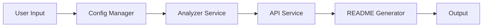

# @readme-gen/cli

> Enterprise README Generator CLI

  

[README](README.md)


# @readme-gen/cli

## Overview

@readme-gen/cli is a command-line interface (CLI) tool designed to generate high-quality README files for software projects. It leverages various services and tools to analyze project metadata, generate accurate README content, and provide users with a seamless experience.

## Architecture



## Installation

To install @readme-gen/cli, run the following command:

```bash
npm install @readme-gen/cli
```

## Usage

### Example 1: Generating a README file

```bash
npx @readme-gen/cli generate-readme --tone=friendly --persona=developer
```

This command will generate a README file with a friendly tone and a developer persona.

### Example 2: Previewing a README file

```bash
npx @readme-gen/cli preview --tone=professional --persona=engineer
```

This command will preview a README file with a professional tone and an engineer persona.

## Deployment

To build the CLI tool, run the following command:

```bash
npm run build
```

To deploy the CLI tool, use the following Docker deployment instructions:

```bash
docker build -t @readme-gen/cli .
docker run -it @readme-gen/cli
```

## Contributing

Contributions to @readme-gen/cli are welcome. Please follow the standard contribution guidelines:

1. Fork the repository.
2. Create a new branch for your feature or bug fix.
3. Commit your changes.
4. Push your changes to the remote repository.
5. Open a pull request.

## Tech Stack

@readme-gen/cli is built with the following technologies:

* TypeScript
* CLI Tool
* Environment Configuration

## Dependencies

The following dependencies are used in @readme-gen/cli:

* axios
* chalk
* commander
* conf
* dotenv
* glob
* ignore
* inquirer
* ora
* ts-morph
* @readme-gen/analyzer

## API Endpoints

The following API endpoints are used in @readme-gen/cli:

| Method | Endpoint | Source File |
|--------|----------|-------------|
| GET | `provider` | src/commands/config/index.ts |
| GET | `apiUrl` | src/services/api.service.ts |
| GET | `provider` | src/services/api.service.ts |
| GET | `groqKey` | src/services/api.service.ts |
| GET | `openaiKey` | src/services/api.service.ts |
| GET | `geminiKey` | src/services/api.service.ts |
| GET | `provider` | src/services/api.service.ts |
| GET | `provider` | src/config/config-manager.ts |
| GET | `groqKey` | src/config/config-manager.ts |
| GET | `openaiKey` | src/config/config-manager.ts |
| GET | `geminiKey` | src/config/config-manager.ts |
| GET | `provider` | src/commands/init.ts |
| GET | `model` | src/commands/init.ts |
| GET | `provider` | src/commands/generate.ts |
| GET | `provider` | src/commands/generate-readme.ts |
| GET | `geminiKey` | src/commands/generate-readme.ts |
| GET | `openaiKey` | src/commands/generate-readme.ts |
| GET | `groqKey` | src/commands/generate-readme.ts |
| GET | `model` | src/commands/generate-readme.ts |

## Environment Variables

The following environment variables are used in @readme-gen/cli:

```env
GOOGLE_GENERATIVE_AI_API_KEY=your_value_here
GROQ_API_KEY=your_value_here
```

## Code Patterns

The following code patterns are used in @readme-gen/cli:

* CLI Tool found in: src/index.ts, src/index.ts, src/index.ts, src/index.ts, src/index.ts
* Environment Configuration found in: src/commands/generate-readme.ts, src/commands/generate-readme.ts, src/commands/generate-readme.ts, src/commands/generate-readme.ts, src/commands/generate-readme.ts

## Code Surface

The following code surface is used in @readme-gen/cli:

* src/index.ts
* src/commands/config/index.ts
* src/services/api.service.ts
* src/services/analyzer.service.ts
* src/constants/personas.ts
* src/config/config-manager.ts
* src/commands/preview.ts
* src/commands/init.ts
* src/commands/generate.ts
* src/commands/generate-readme.ts

Note: The code surface is a verbatim representation of the code artifacts in the project.

### ⚙️ Environment Configuration
```env
GOOGLE_GENERATIVE_AI_API_KEY=
GROQ_API_KEY=
```